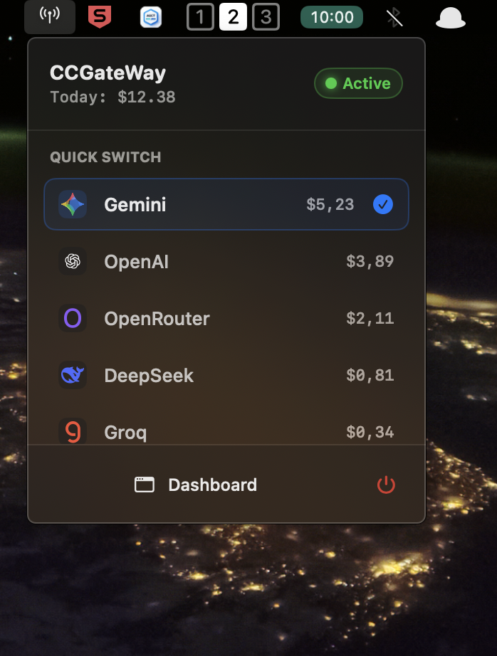

<p align="center">
  
</p>

<h1 align="center">Claude Code Gateway</h1>

<p align="center">
  <strong>Use Claude Code with any LLM -- one click from your Mac menu bar.</strong><br>
  Zero config &bull; Instant preset switching &bull; Local cost tracking
</p>

<p align="center">
  <a href="#requirements"></a>
  <a href="#requirements"></a>
  <a href="#build--run"></a>
</p>

---

## What is CCGateWay?

Claude Code only speaks Anthropic's API. If you want to use it with Gemini, OpenAI, DeepSeek, Groq, OpenRouter, or any other provider, you'd normally need to wrestle with proxy setups, env vars, and restarts every time you switch.

CCGateWay fixes that. It's a lightweight native macOS menu bar app that sits between Claude Code and your LLM provider. It translates requests and responses on the fly -- Claude Code sends its usual Anthropic-format calls, CCGateWay converts them into whatever format your provider expects (OpenAI, Gemini, etc.), gets the response, and converts it back to Anthropic format before returning it. Claude Code never knows the difference.

**The result:** you can use Claude Code with any model from any provider, and switching presets is one click in the menu bar. No restarts, no config editing, no terminal commands.

### Dead simple to set up

1. `brew install --cask ccgateway` -- installs to your menu bar
2. Add providers + create a preset that maps your slots
3. Activate a preset. CCGateWay auto-configures Claude Code

No Node. No Python. No Docker. No YAML files. Just a native Mac app that works.

## How It Works

```
Claude Code  ──(Anthropic Messages API)──►  CCGateWay (127.0.0.1)
                                                │
                                          translates request
                                                │
                                      ┌─────────┼─────────┐
                                      ▼         ▼         ▼
                                   Gemini    OpenAI    OpenRouter
                                             DeepSeek  Groq
                                             (any OpenAI-compatible)
                                                │
                                        translates response
                                                │
                                                ▼
                                    Claude Code receives
                                    Anthropic-shaped response
```

CCGateWay runs a local server on `127.0.0.1` that exposes Anthropic-compatible endpoints. Under the hood, it handles the full translation between API formats:

- **Request translation** -- Anthropic message format (system prompts, tool definitions, content blocks) is converted to the target provider's format (OpenAI chat completions, Gemini generateContent, etc.)
- **Response translation** -- Provider responses are converted back to Anthropic's format, including content blocks, stop reasons, usage tokens, and tool call results
- **Streaming** -- SSE streams from any provider are translated chunk-by-chunk into Anthropic SSE events in real time

| Endpoint | Purpose |
|----------|---------|
| `POST /v1/messages` | Anthropic-compatible messages (streaming + non-streaming) |
| `GET  /health` | Health check |

### Slot-Based Routing

Claude Code uses different model names for different tasks (e.g. "haiku" for background work, "opus" for deeper reasoning). CCGateWay intercepts the model string, maps it to a **slot**, and routes to the provider/model pair configured for that slot on the active preset.

| Slot | When Claude Code uses it |
|------|--------------------------|
| `default` | Standard completions |
| `background` | Background / lightweight tasks |
| `think` | Deep reasoning / chain-of-thought |
| `longContext` | Large context windows |

## Features

- **Menu bar quick switch** -- change active preset without leaving your editor
- **Dashboard** -- configure providers, build presets, assign slot mappings, view usage
- **Anthropic-compatible gateway** -- drop-in replacement, streaming + non-streaming
- **Provider adapters** -- Gemini native + OpenAI-compatible (OpenAI, OpenRouter, DeepSeek, Groq, custom)
- **Tool / function calling** -- passthrough for OpenAI-compatible providers
- **Model catalog** -- curated list with per-token pricing for cost estimation
- **Keychain storage** -- API keys never leave macOS Keychain
- **Local cost tracking** -- usage + cost history persisted on disk

## Install

### Homebrew (recommended)

```bash
brew tap skainguyen1412/tap
brew install --cask ccgateway
```

That's it. Launch **CCGateWay** from your Applications folder — it lives in the menu bar.

### Manual download

1. Download `CCGateWay.zip` from the [latest release](https://github.com/skainguyen1412/claude-code-gateway/releases/latest)
2. Unzip and drag `CCGateWay.app` into your **Applications** folder
3. Open the app

> **⚠️ Note:** CCGateWay is not signed with an Apple Developer ID or notarized. macOS will block it on first launch. To allow it:
>
> - **Option A:** Right-click the app → **Open** → click **Open** in the dialog
> - **Option B:** Go to **System Settings** → **Privacy & Security** → scroll down and click **Open Anyway**
> - **Option C:** Remove the quarantine flag manually:
>   ```bash
>   xattr -d com.apple.quarantine /Applications/CCGateWay.app
>   ```
>
> The Homebrew install handles this automatically.

### Build from source

<details>
<summary>Requirements & instructions</summary>

| Dependency | Version |
|------------|---------|
| macOS | 14+ |
| Xcode | Swift 6 toolchain |
| [Tuist](https://tuist.io) | Latest |

```bash
git clone https://github.com/skainguyen1412/claude-code-gateway.git
cd claude-code-gateway/CCGateWay

# Install dependencies & generate the Xcode workspace
tuist install
tuist generate

# Open in Xcode and run the CCGateWay scheme
open CCGateWay.xcworkspace
```

</details>

The app installs in the menu bar. Open the dashboard from the dropdown.

## Setup

### 1. Add Providers

1. Open **Dashboard** > **Providers**
2. Pick a template (Gemini, OpenAI, OpenRouter, DeepSeek, Groq) or enter a custom endpoint
3. Paste your API key (stored in Keychain)
4. Assign models to each slot (`default` / `background` / `think` / `longContext`)
5. **Test Connection**, then **Save**

### 2. Create a Preset

1. Open **Dashboard** > **Presets**
2. Add a preset and map each slot to a provider + model
3. Save the preset (each referenced provider must have a valid API key)

### 3. Activate

Use the menu bar quick switch or click **Make Active** in the Presets dashboard.

### 4. Claude Code Auto-Sync

CCGateWay automatically writes to `~/.claude/settings.json` when you switch presets, setting:

- `ANTHROPIC_BASE_URL` to `http://127.0.0.1:<port>`
- `ANTHROPIC_MODEL` and slot env vars to the active preset's slot models

To revert: **Settings** > **Reset Claude Code Settings** (removes CCGateWay-injected env vars).

## Test the Gateway

```bash
# Health check
curl -sS http://127.0.0.1:3456/health
```

```bash
# Non-streaming
curl -sS http://127.0.0.1:3456/v1/messages \
  -H "Content-Type: application/json" \
  -d '{
    "model": "claude-3-5-sonnet-20241022",
    "max_tokens": 256,
    "messages": [{"role": "user", "content": "Hello from CCGateWay"}]
  }'
```

```bash
# Streaming (SSE)
curl -N http://127.0.0.1:3456/v1/messages \
  -H "Content-Type: application/json" \
  -d '{
    "model": "claude-3-5-sonnet-20241022",
    "max_tokens": 256,
    "stream": true,
    "messages": [{"role": "user", "content": "Stream a short response"}]
  }'
```

## Data & Security

| What | Where |
|------|-------|
| App config | `~/Library/Application Support/CCGateWay/config.json` |
| Usage history | `~/.ccgateway/usage_history.json` |
| API keys | macOS Keychain (`dev.tuist.CCGateWay`) |

**Privacy:**
- Gateway binds to `127.0.0.1` only -- not exposed on your network
- API keys stored in Keychain, never written to disk as plaintext
- Usage/cost data stays local
- Request log stores metadata (slot, model, tokens, cost, latency); upstream response previews may appear in stdout during debugging

## Roadmap

- [ ] Support for more models and providers

## Contributing

Issues and PRs welcome. For provider compatibility issues, please include:

1. Provider name + base URL
2. Streaming or non-streaming
3. Redacted request/response snippet (remove secrets)

## Disclaimer

Not affiliated with Anthropic, Google, OpenAI, OpenRouter, DeepSeek, or Groq. Provider names are used only to describe compatibility.

## Acknowledgements

- [Claude Code Router](https://github.com/nicholasgriffintn/claude-code-router) -- inspiration for this project
- [LiteLLM](https://github.com/BerriAI/litellm) -- model pricing data
